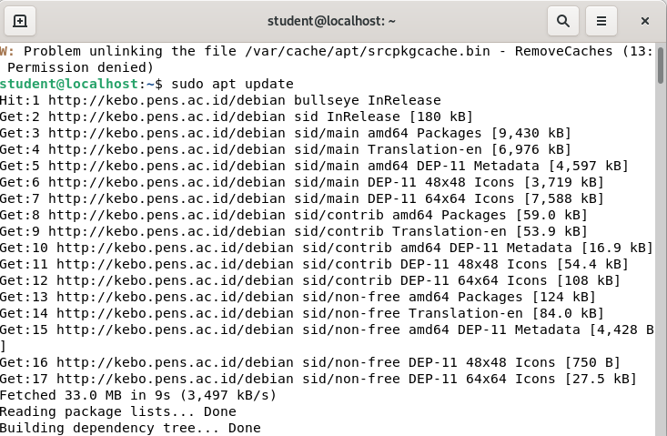
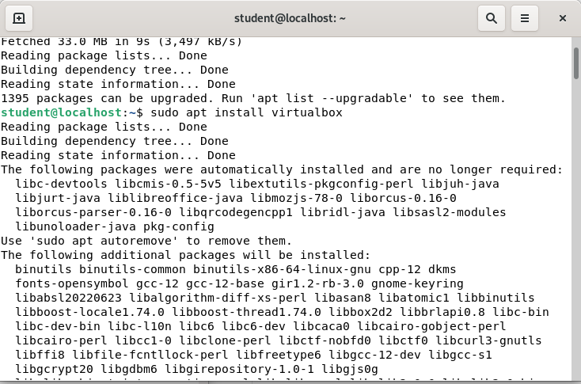
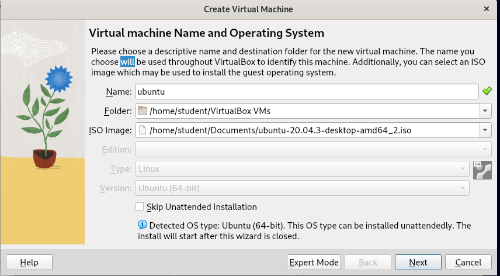
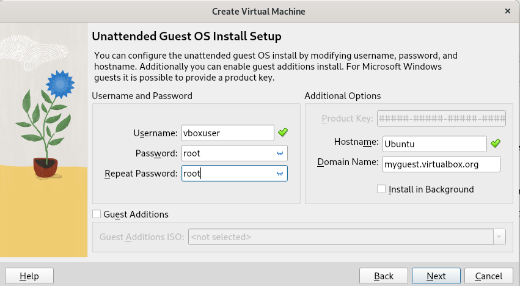
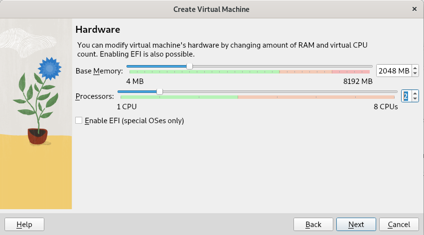
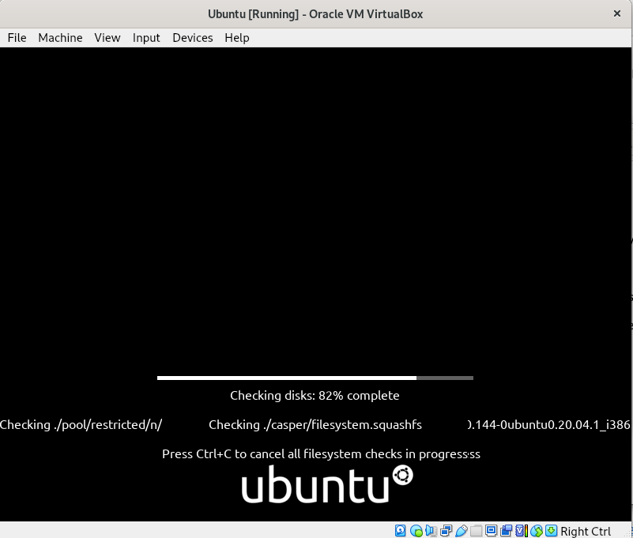
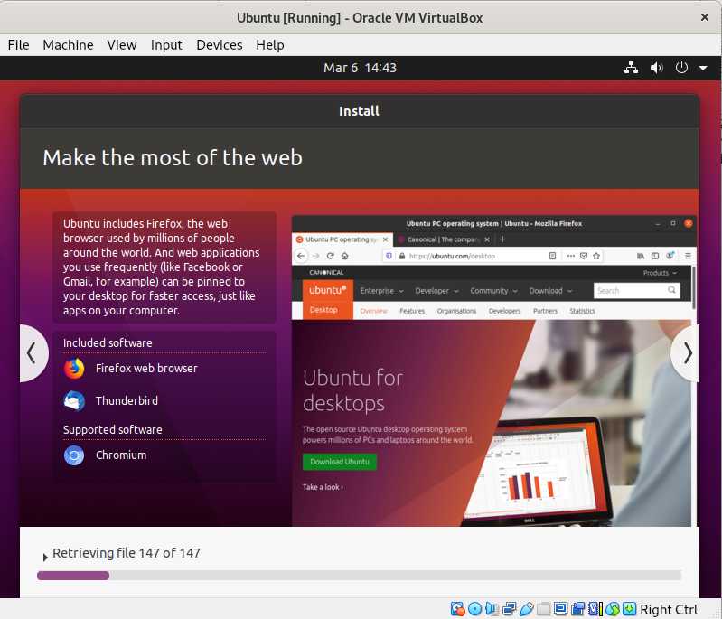

## Tugas Routing
### Kelompok 7
<P>Akbar Pratama Bimantoro (3121600053)</p>
<p>Imam Shofiudin (3121600057)</p>
<p>Nicho adhyatma (3121600049)</P>

### Cek IP Address PC dan Tiap PC lainnya
pastikan semua PC mendapatkan ip sesuai dengan yang ditentukan

### Install Wine

- Buka terminal dan perbarui sistem anda, jalankan :

```sh
sudo apt-get update
sudo apt-get upgrade
```

- Setelah proses pembaruan selesai, jalankan perintah berikut untuk menginstal Wine:

```sh
sudo apt-get install wine
```

- Jika Anda menggunakan sistem operasi Debian 64-bit, jalankan perintah berikut untuk menginstal dependensi 32-bit yang diperlukan untuk menjalankan aplikasi 32-bit di Wine:

```sh
sudo dpkg --add-architecture i386
sudo apt-get update
sudo apt-get install wine32
```

### Buka WInbox
setelah sudah mencatat semua ip PC, buka Winbox dengan command *win winbox64.exe*, jika sudah terbuka akan seperti ini


### Konfigursai IP Address
<p>kemudian buka IP>Route>klik tanda +<p>


masukkan ip addres sebagai tujuan ke Dst. Address untuk yang gateway masukan IP ether 1 yang ada di ip tujuan,
jika sudah dimasukkan semua ip tiap pc akan seperti ini


### Cek IP Routingan
jika sudah dimasukkan semua kita masuk ke terminal yang ada di winbox untuk mengecek apakah sudah terhubung atau belum


### Instalasi Virtual Box di Ubuntu
yang pertama kita masuk ke source.list untuk mengatur repo masukkan command berikut ```deb http://kebo.pens.ac.id/debian sid main contrib non-free```
  

  
setelah itu lakukan update dengan command sudo apt update
  

  
 kemudian lakukan langkah instalasi virtual box dengan command sudo apt install vierualbox
  
 
  
 ### Membuat Virtual Machine
 
 
 
 
 
