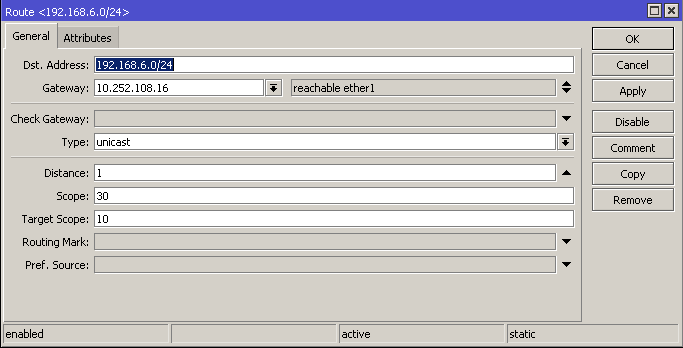

## Tugas Routing
### Kelompok 7

Akbar Pratama Bimantoro (3121600053)

Imam Shofiudin ()

Nicho ()

### Cek IP Address PC dan Tiap PC lainnya
pastikan semua PC mendapatkan ip sesuai dengan yang ditentukan

### Buka WInbox
setelah sudah mencatat semua ip PC, buka Winbox dengan command *win winbox64.exe*, jika sudah terbuka akan seperti ini

### Konfigursai IP Address

kemudian buka IP>Route>klik tanda +

masukkan ip addres sebagai tujuan ke Dst. Address untuk yang gateway masukan IP ether 1 yang ada di ip tujuan,
jika sudah dimasukkan semua ip tiap pc akan seperti ini

### Cek IP Routingan
jika sudah dimasukkan semua kita masuk ke terminal yang ada di winbox untuk mengecek apakah sudah terhubung atau belum

### Instalasi Virtual Box di Ubuntu
yang pertama kita masuk ke source.list untuk mengatur repo masukkan command berikut *deb http://kebo.pens.ac.id/debian sid main contrib non-free*

